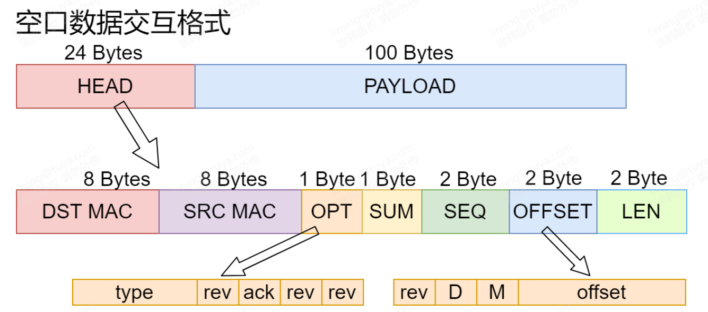

# rf_stack

## 简介

rf_stack 是一个简单的 2 层网络协议栈，可以移植到任何射频芯片上，类似于 TCP/IP 中的 MAC 层，支持单播和广播，同时支持数据分包和分包重组，
协议栈简单明了，可以很好地实现一个星形拓扑结构


## 移植方法

1. 进出临界宏的移植：在 rf_stack_cfg.h 中把下面的宏定义成芯片平台上的开关中断的宏；

```c
#define ENTER_CRITICAL()    // TODO:
#define EXIT_CRITICAL(pri)  // TODO:
```

2. 周期定时器的移植：协议栈需要用户实现一套软件定时器机制，并注册到rf_tmr.c中；

```c
    rf_tmr_t rf_tmr = {
        .tmr_id = RF_TIMER_ID,
        .interval = RF_INTERVAL,
        .tmr_start =    // TODO:
        .tmr_stop =     // TODO:
    };
    rf_tmr_init_and_start(rf_tmr_t *tmr)
```

3. 射频底层收发接口适配：在 radio_phy.c 中适配相关的射频发送和注册数据接收回调，并实现射频功能的初始化；

```c
// 此函数需要用户编写射频初始化函数，并注册 vendor_radio_input_callback 数据接收回调
void vendor_radio_init(int8_t power, uint8_t channel);
// 此函数需要用户移植芯片平台上的数据发送接口
void vendor_radio_output(struct rf_card* p_card, uint8_t* packet, uint16_t len);

```

4. 协议栈配置：用户根据需要在 rf_stack_cfg.h 和 rf_stack_opt.h 中进行配置更改


## Examples

```c
#include "elog.h"

int main(void)
{
    int8_t ret;
    uint8_t mac_addr[MAX_HWADDR_LEN] = {0x11,0x22,0x33,0x44,0x55,0x66,0x77,0x88};
    
    mem_t mem = {
        .malloc_fn = rf_malloc,
        .free_fn = rf_free
    };
    mem_init(&mem);

    zig_card.channel = RF_CHANNEL;
    zig_card.rf_power = RF_POWER;
    zig_card.hwaddr_len = MAX_HWADDR_LEN;
    memcpy(zig_card.hwaddr, mac_addr, MAX_HWADDR_LEN);
    
    ret = rf_card_add_and_init(&zig_card, rf_recv_callback, rf_card_init);
    if (ret == ERR_OK) {
        rf_card_set_default(&zig_card);
        timer_init_and_start();
    }
}

```

## 数据格式
```c
/* mac head */
struct mac_hdr {
    struct mac_addr dest;
    struct mac_addr src;
    uint8_t options;
#define FRAME_TYPE  0xE0    // frame type
#define RECV1       0x18    // reserved
#define ACK_REQ     0x04    // ack request
#define RECV2       0x03    // reserved
    uint8_t sum;
    uint16_t seqnum;
    uint16_t offset;
#define RF_FLG      0x8000U // reserved fragment flag
#define DF_FLG      0x4000U // don't fragment flag
#define MF_FLG      0x2000U // more fragments flag
#define OFFSET_MASK 0x1FFFU // mask for fragmenting bits
    uint16_t len;           // total length of mac layer(hdr len + payload len)
}__PACKED;
```
